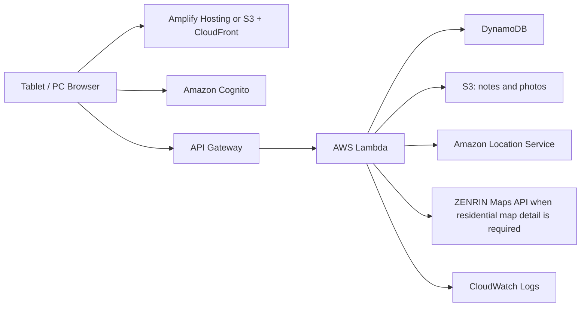

# 営業用地図アプリ MVP

シロアリ防除・点検の訪問販売で使う紙地図運用を、タブレット・PCで共有できる業務データへ置き換えるための初回プロトタイプです。

この版は要件書の Step 1〜Step 7 に対応しています。

- Next.js + TypeScript + Tailwind CSS
- モック認証による管理者 / 営業担当者の画面切り替え
- MockMapProvider による API キー不要の地図風UI
- 住所入力または地図タップによる地点登録
- 地点の追加・編集・論理削除
- 地点詳細に紐づくCanvas手書きメモのPNG保存
- 今日の訪問予定作成、地点追加、訪問順の並び替え
- MockRouteService による訪問順の簡易最適化、総距離・推定時間・地図上ルート表示
- GitHub Pagesで動くブラウザ内保存と、AWS移行用のRepository層
- AWS / DynamoDB / Cognito / 地図APIへ差し替えやすい構成

## ローカル起動

PowerShell では `npm` が実行ポリシーに止められることがあるため、`npm.cmd` を使います。

```powershell
npm.cmd install
npm.cmd run dev
```

起動後、表示された `http://localhost:3000` を開きます。

検証用コマンド:

```powershell
npm.cmd run typecheck
npm.cmd run lint
npm.cmd run build
```

## GitHub Pages公開

このアプリはGitHub Pagesで公開できるよう、Next.jsの静的出力に対応しています。

- `next.config.ts` で `output: "export"` を設定
- GitHub Actions: `.github/workflows/pages.yml`
- Pages公開時は `GITHUB_PAGES=true` により `/sells_map` の `basePath` を付与
- GitHub PagesではサーバーAPIが動かないため、画面操作データはブラウザの `localStorage` に保存

公開後は GitHub リポジトリの `Settings > Pages` で Source を `GitHub Actions` に設定してください。

## 現在の実装

ログイン画面では Cognito の代わりに検証ユーザーを選択します。

- 管理者: 全地点、管理者ダッシュボード、担当者切り替え
- 営業担当者: 自分の担当者・担当エリア中心の地点表示

初期地点データは `data/locations.json` から読み込みます。画面で追加・編集・削除したデータはブラウザの `localStorage` に保存されます。削除は物理削除ではなく `deletedAt` を付ける論理削除です。

地点追加では緯度・経度を直接入力しません。住所を入力して「住所から位置を計算」を押すか、MockMapProvider の地図上をタップすると内部座標が自動で入ります。保存時に位置が未指定の場合も、住所から自動計算を試みます。

手書きメモは地点詳細の「手書きメモ」から作成できます。GitHub Pages版ではPNGデータをブラウザの `localStorage` に保存します。S3へ移行しやすいように `StorageService` の境界は残しています。

訪問予定は左側の「訪問予定」パネルで作成できます。地図または地点一覧で地点を選び、「選択地点を追加」で訪問先に入れ、上下ボタンで訪問順を変更します。件数が多い日は「地図で選ぶ」をオンにすると、地図上のピンを複数選択してまとめて訪問予定へ追加できます。180件規模でも1件ずつ詳細を開かずに候補を作れる前提です。GitHub Pages版では訪問予定もブラウザの `localStorage` に保存します。

訪問先が2件以上ある場合は「ルート最適化」で訪問順を並び替えられます。初回実装では `MockRouteService` が現在の先頭地点を出発地点として近い順に並べ、総距離・推定時間・Mock地図上のルート線を表示します。将来は同じ `RouteService` 境界で Amazon Location Service の `OptimizeWaypoints` / `CalculateRoutes` へ差し替える想定です。

主な型と差し替え境界:

- `User`, `Location`, `VisitRecord`
- `LocationRepository`
- `HandwrittenNoteRepository`
- `VisitPlanRepository`
- `StorageService`
- `MapTileProvider`
- `GeocodingService`
- `RouteService`

## AWS移行方針

GitHub Pages版は静的プロトタイプですが、以下へ移行する前提で層を分けています。



想定する置き換え:

- モック認証から Amazon Cognito へ
- ローカルJSON Repository から DynamoDB Repository へ
- MockMapProvider から Amazon Location Service / ZENRIN Maps API / MapLibre互換タイルへ
- 後続フェーズで手書きメモ保存先をS3へ差し替え、MockRouteServiceをAmazon Location Serviceへ接続し、CSVインポートを追加

紙地図スキャンやコピー画像の取り込みは前提にしません。地図データは正規ライセンスのAPI利用を前提にします。

## コスト試算の前提

正確なAWS料金・地図API料金は利用量依存です。コード内に固定単価は入れていません。

- 営業担当者: 9人
- 管理者: 1〜3人
- 地点データ: 初期5,000件
- 訪問履歴: 年間20,000件
- 手書きメモ・写真: 月数GB以下
- AWS構成: 小規模サーバーレス前提
- AWS利用料: 月数千円〜数万円程度を想定
- 地図API費用: 別枠、要見積り
- 住宅地図利用時: ZENRIN等の個別見積り

## プロセス改善効果の試算

現行想定:

- 営業9人
- 1人あたり紙地図100枚超
- 紙地図探索、重複確認、ルート検討、転記、コピー差し替えで1人あたり月16〜30時間程度の非効率
- 9人で月144〜270時間
- 1人月160時間換算で0.9〜1.7人月/月

導入後想定:

- 1人あたり月3〜6時間程度まで削減
- 9人で月27〜54時間
- 改善効果は月90〜225時間程度
- 1人月160時間換算で0.56〜1.4人月/月の改善余地

## 次フェーズ候補

- 訪問履歴: 地点詳細から訪問記録追加
- ルート最適化: MockRouteService から Amazon Location Service の OptimizeWaypoints / CalculateRoutes へ
- 重複判定: 住所一致、20m以内、訪問NG、施工済み警告
- 管理者機能: CSVインポート / エクスポート
