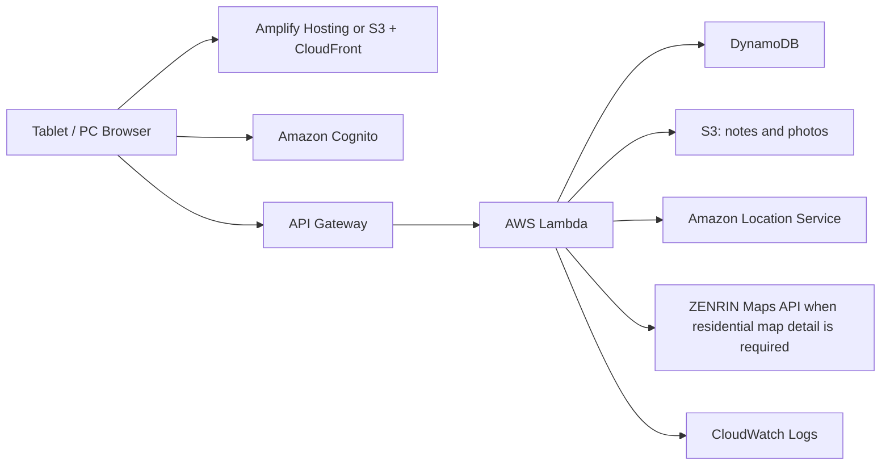
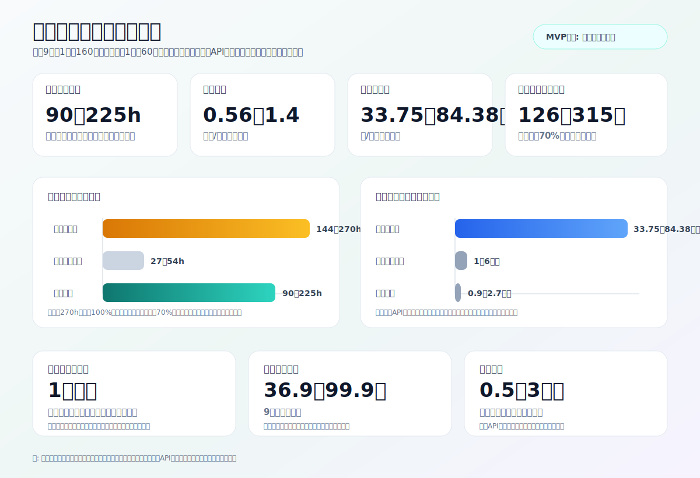
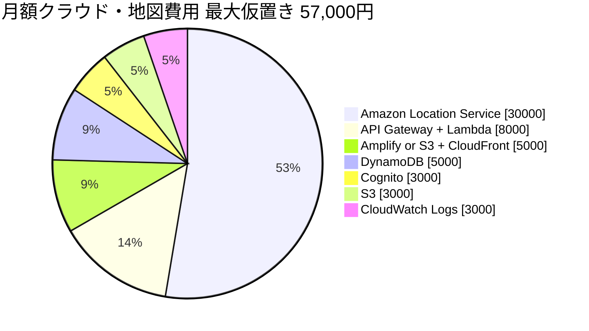
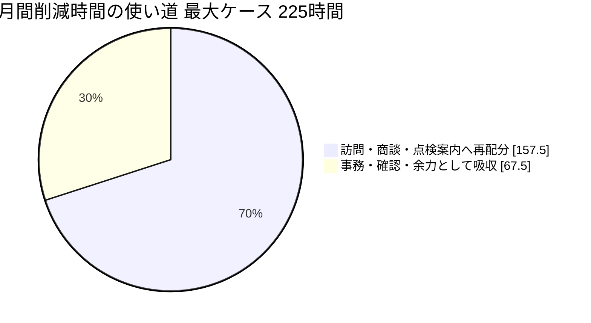
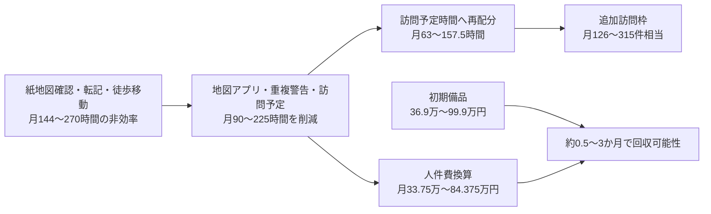

# 営業用地図アプリ MVP

シロアリ防除・点検の訪問販売で使う紙地図運用を、タブレット・PCで共有できる業務データへ置き換えるための初回プロトタイプです。

この版は要件書の Step 1〜Step 13 に対応しています。

- Next.js + TypeScript + Tailwind CSS
- モック認証による管理者 / 営業担当者の画面切り替え
- MockMapProvider による API キー不要の地図風UI
- 住所入力または地図タップによる地点登録
- 地点の追加・編集・論理削除
- 地点詳細に紐づくCanvas手書きメモのPNG保存
- 今日の訪問予定作成、地点追加、訪問順の並び替え
- MockRouteService による訪問順の簡易最適化、総距離・推定時間・地図上ルート表示
- 地点登録・訪問予定追加時の重複候補警告
- 管理者向けの集計ダッシュボード、CSVインポート / エクスポート
- 地図を大きく見ながら作業するための全画面地図モード
- 地点詳細からの訪問履歴追加、最終訪問日・ステータス更新
- CSV入出力、重複警告、ルート最適化、訪問結果変換の自動テスト
- Loopedレビューに基づく管理者向け要対応チェック、利用者向け作業サマリー
- GitHub Pagesで動くブラウザ内保存と、AWS移行用のRepository層
- AWS / DynamoDB / Cognito / 地図APIへ差し替えやすい構成

## ローカル起動

PowerShell では `npm` が実行ポリシーに止められることがあるため、`npm.cmd` を使います。

```powershell
npm.cmd install
npm.cmd run dev
```

起動後、表示された `http://localhost:3000` を開きます。

検証用コマンド:

```powershell
npm.cmd run typecheck
npm.cmd run lint
npm.cmd run test
npm.cmd run build
```

## GitHub Pages公開

このアプリはGitHub Pagesで公開できるよう、Next.jsの静的出力に対応しています。

- `next.config.ts` で `output: "export"` を設定
- GitHub Actions: `.github/workflows/pages.yml`
- Pages公開前に `test` / `typecheck` / `lint` / `build` を実行
- Pages公開時は `GITHUB_PAGES=true` により `/sells_map` の `basePath` を付与
- GitHub PagesではサーバーAPIが動かないため、画面操作データはブラウザの `localStorage` に保存

公開後は GitHub リポジトリの `Settings > Pages` で Source を `GitHub Actions` に設定してください。

## 現在の実装

ログイン画面では Cognito の代わりに検証ユーザーを選択します。

- 管理者: 全地点、管理者ダッシュボード、担当者切り替え
- 営業担当者: 自分の担当者・担当エリア中心の地点表示

初期地点データは `data/locations.json` から読み込みます。画面で追加・編集・削除したデータはブラウザの `localStorage` に保存されます。削除は物理削除ではなく `deletedAt` を付ける論理削除です。

地点追加では緯度・経度を直接入力しません。住所を入力して「住所から位置を計算」を押すか、MockMapProvider の地図上をタップすると内部座標が自動で入ります。保存時に位置が未指定の場合も、住所から自動計算を試みます。

地図右上の「全画面」から、地図を画面いっぱいに広げる地図作業モードへ切り替えられます。全画面中もピン選択、地図タップによる位置指定、訪問予定用の複数選択、ルート線表示は同じ操作で使えます。「通常画面に戻る」またはEscキーで通常画面に戻ります。

手書きメモは地点詳細の「手書きメモ」から作成できます。GitHub Pages版ではPNGデータをブラウザの `localStorage` に保存します。S3へ移行しやすいように `StorageService` の境界は残しています。

訪問履歴は地点詳細の「訪問履歴」から追加できます。訪問日時、結果、次回アクション日、メモを記録でき、保存すると地点の最終訪問日とステータスも更新されます。初期データは `data/visit-records.json` から読み込み、画面で追加した履歴はブラウザの `localStorage` に保存されます。

訪問予定は左側の「訪問予定」パネルで作成できます。地図または地点一覧で地点を選び、「選択地点を追加」で訪問先に入れ、上下ボタンで訪問順を変更します。件数が多い日は「地図で選ぶ」をオンにすると、地図上のピンを複数選択してまとめて訪問予定へ追加できます。180件規模でも1件ずつ詳細を開かずに候補を作れる前提です。GitHub Pages版では訪問予定もブラウザの `localStorage` に保存します。

訪問先が2件以上ある場合は「ルート最適化」で訪問順を並び替えられます。初回実装では `MockRouteService` が現在の先頭地点を出発地点として近い順に並べ、総距離・推定時間・Mock地図上のルート線を表示します。将来は同じ `RouteService` 境界で Amazon Location Service の `OptimizeWaypoints` / `CalculateRoutes` へ差し替える想定です。

地点登録や訪問予定追加では、同住所、半径20m以内、顧客名類似、施工済み、点検予定、訪問NGの候補を警告表示します。初回実装では登録や追加を止めず、現場判断のための注意表示にしています。

管理者画面では、地点総数、点検予定、訪問NG、重複候補の件数を確認できます。ステータス別・担当者別の内訳、注意が必要な重複候補一覧も表示します。

管理者向けには「要対応・データ品質チェック」も表示します。担当者未割当、訪問NG、点検予定日超過、訪問履歴なしを優先度つきで確認できます。

営業担当者向けには、訪問予定パネルに「今日の作業サマリー」を表示します。訪問先数、次の訪問先、ルート最適化状態、地図選択中件数をまとめて確認できます。

CSVエクスポートでは、現在ブラウザに保存されている地点データを `customerName,address,lat,lng,status,assignedUserId,constructionDate,nextInspectionDate,memo,tags` 形式で出力します。CSVインポートでは住所だけの行でもMockGeocodingServiceで内部座標を補完します。GitHub Pages版ではCSVで取り込んだ地点もブラウザの `localStorage` に保存されます。

Loopedレビューの記録は `docs/looped-review-step13.md` に残しています。

要件定義書、テスト仕様書、テスト結果は以下に整理しています。

- `docs/requirements.md`
- `docs/test-specification.md`
- `docs/test-results.md`

自動テストは Vitest で実行します。CSV入出力、重複候補・訪問NG警告、MockRouteService の訪問順最適化、訪問結果から地点ステータスへの変換を対象にしています。画面の主要フローは引き続きブラウザ確認で補完します。

主な型と差し替え境界:

- `User`, `Location`, `VisitRecord`
- `LocationRepository`
- `HandwrittenNoteRepository`
- `VisitRecordRepository`
- `VisitPlanRepository`
- `StorageService`
- `MapTileProvider`
- `GeocodingService`
- `RouteService`
- `DuplicateCandidate`

## AWS移行方針

GitHub Pages版は静的プロトタイプですが、以下へ移行する前提で層を分けています。



想定する置き換え:

- モック認証から Amazon Cognito へ
- ローカルJSON Repository から DynamoDB Repository へ
- MockMapProvider から Amazon Location Service / ZENRIN Maps API / MapLibre互換タイルへ
- 後続フェーズで手書きメモ保存先をS3へ差し替え、MockRouteServiceをAmazon Location Serviceへ接続し、重複判定とCSVインポートをAPI側に移行

紙地図スキャンやコピー画像の取り込みは前提にしません。地図データは正規ライセンスのAPI利用を前提にします。

## コスト試算の前提

正確なAWS料金・地図API料金は利用量、契約、住宅地図の必要精度で変わります。以下は社内検討用の仮置きで、コード内に固定単価は入れていません。

業務規模の仮定:

- 営業担当者: 9人
- 管理者: 1〜3人
- 地点データ: 初期5,000件
- 訪問履歴: 年間20,000件
- 手書きメモ・写真: 月数GB以下
- 1人月: 160時間
- 人件費単価: 1人月 60万円、1時間 3,750円で仮置き

クラウド・地図費用の仮置き:

| 項目 | 月額仮置き | 備考 |
| --- | ---: | --- |
| Amplify Hosting または S3 + CloudFront | 1,000〜5,000円 | 静的Web配信、小規模利用想定 |
| Cognito | 0〜3,000円 | 9人＋管理者数名では小規模 |
| API Gateway + Lambda | 1,000〜8,000円 | API回数が少ない前提 |
| DynamoDB | 1,000〜5,000円 | 地点・履歴・予定データ |
| S3 | 500〜3,000円 | 手書きメモ、写真が月数GB以下 |
| CloudWatch Logs | 500〜3,000円 | ログ量に依存 |
| Amazon Location Service | 5,000〜30,000円 | 地図表示、ジオコーディング、ルート計算の回数に依存 |
| 住宅地図API | 要見積り | ZENRIN等。住宅地図精度が必要な場合は別途法人契約 |

AWS等の小規模サーバーレス合計は、住宅地図APIを除き月1万〜6万円程度を仮置きします。住宅地図API、商用地図API、精密なルート最適化APIは別枠で要見積りです。

## プロセス改善効果の試算

現行想定:

- 営業9人
- 1人あたり紙地図100枚超
- 現在は地図が紙のため、地図確認・重複確認・ルート検討・転記・コピー差し替えが発生
- 紙地図を見ながら徒歩で確認するため、1日1万歩超になるケースがある
- 1人あたり月16〜30時間程度の非効率があると仮定
- 9人で月144〜270時間
- 1人月160時間換算で0.9〜1.7人月/月
- 金額換算: 月54万〜101.25万円、年648万〜1,215万円相当

導入後想定:

- 住所検索、地図ピン、重複警告、訪問予定、ルート最適化で確認作業を短縮
- 1人あたり月3〜6時間程度まで削減
- 9人で月27〜54時間
- 改善効果は月90〜225時間程度
- 1人月160時間換算で0.56〜1.4人月/月の改善余地
- 金額換算: 月33.75万〜84.375万円、年405万〜1,012.5万円相当

訪問予定時間の増加効果:

- 削減された時間のうち70%を訪問・商談・点検案内に回せると仮定
- 月90〜225時間の削減に対して、月63〜157.5時間の訪問予定時間増加
- 1件あたり訪問・記録・移動の追加枠を30分とすると、月126〜315件分の訪問予定枠に相当
- 実際の売上効果は成約率、客単価、点検契約率に依存するため別途営業実績で検証

営業員の身体的負担軽減の試算:

| 対策 | 初期費用仮置き | 月額費用仮置き | 期待効果 |
| --- | ---: | ---: | --- |
| スマホ・タブレットホルダー | 1人 3,000〜8,000円 | 0円 | 地図確認時に端末を取り出す回数を削減 |
| 折り畳み自転車 | 1人 3万〜8万円 | 1,000〜3,000円 | 徒歩1万歩超の移動負担を軽減、短距離訪問の回転率向上 |
| モバイルバッテリー | 1人 3,000〜8,000円 | 0円 | タブレット運用時の電池切れ対策 |
| タブレット用ショルダー・耐衝撃ケース | 1人 5,000〜15,000円 | 0円 | 立ったままの確認、落下対策 |

9人分の初期費用は、最小で約36.9万円、折り畳み自転車を厚めに見ても約99.9万円を仮置きします。月額保守・消耗費は9,000〜27,000円程度です。人件費削減効果だけでなく、徒歩負担を下げて訪問予定時間を増やす投資として評価します。

投資対効果の仮置き:

- システム運用費: 月1万〜6万円程度、住宅地図APIは別途
- 備品月額: 月0.9万〜2.7万円程度
- 初期備品: 36.9万〜99.9万円程度
- 人件費換算の改善効果: 月33.75万〜84.375万円
- 初期備品は、人件費換算だけで見ても約0.5〜3か月で回収できる可能性
- ただし、地図API費、端末費、通信費、実際の運用定着率は別途精査が必要

## 試算グラフ

GitHubのREADMEではHTMLの `img` 埋め込みや Mermaid 記法のグラフを表示できます。以下は仮置きの最大値ベースで、実際の費用・効果は利用量、契約条件、営業実績で再計算します。

<p align="center">
  
</p>

月額クラウド・地図費用の最大仮置き内訳、住宅地図APIを除く:



削減時間の使い道、月225時間削減できた場合:



投資回収の見方:



## 次フェーズ候補

- ルート最適化: MockRouteService から Amazon Location Service の OptimizeWaypoints / CalculateRoutes へ
- テスト強化: ログインから訪問予定作成までのE2Eテスト追加
